<!-- markdownlint-disable -->
<p align="center">
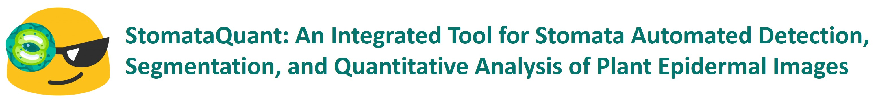
</p>

# StomataQuant

[](#citation)

## 📑 Table of contents

- [🌏 Overview](#overview)
- [🚀 StomataQuant 2.0 Release Notes](#stomataquant-20-release-notes)
- [🏃‍♀️‍➡️ Getting Started](#getting-started)
  - [Model Weights](#model-weights)
  - [💻 Using the Packaged Application](#using-the-packaged-application)
  - [🧑‍💻 Using the Source Code](#using-the-source-code)
- [📄 Program Usage Guide](#program-usage-guide)
  - [😎 Key Features](#key-features)
  - [📣 Basic Workflow — How StomataQuant Works](#basic-operation-flow)
    - [Measurement and Results](#measurement-and-results)
  - [🕵️ Common usage scenarios](#common_usage_scenarios)
    - [Batch Processing](#batch-processing)
    - [Annotation Import and Export](#annotation-import-and-export)
- [📖 Dataset used for training the model](#dataset-used-for-training-the-model)
- [🧩 Software Architecture](#technical-architecture)
  - [🗃️ Code file structure](#code-file-structure)
- [📑 Citation](#citation)
- [📜 License](#license)
- [🤝 Contact Us](#contact-us)

---
<a id="overview"></a>

## 🌏 Overview

**StomataQuant is a graphical user interface (GUI) software designed for plant epidermal stomatal image analysis.**

It combines deep learning with an easy-to-edit annotation interface. You can use AI models to detect or segment **stomata, pores, and pavement cells**, then check and correct the results directly on the image.

The workflow is straightforward: **AI gives you a starting result, and you decide the final annotation.** You can move, add, delete, relabel, or hide shapes at any time, and the measurements update automatically as you make changes.


<p align="center">
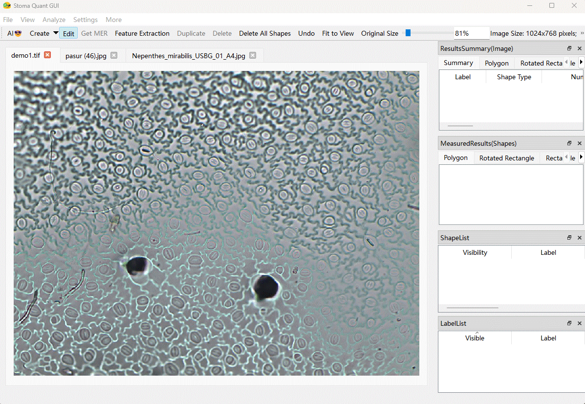
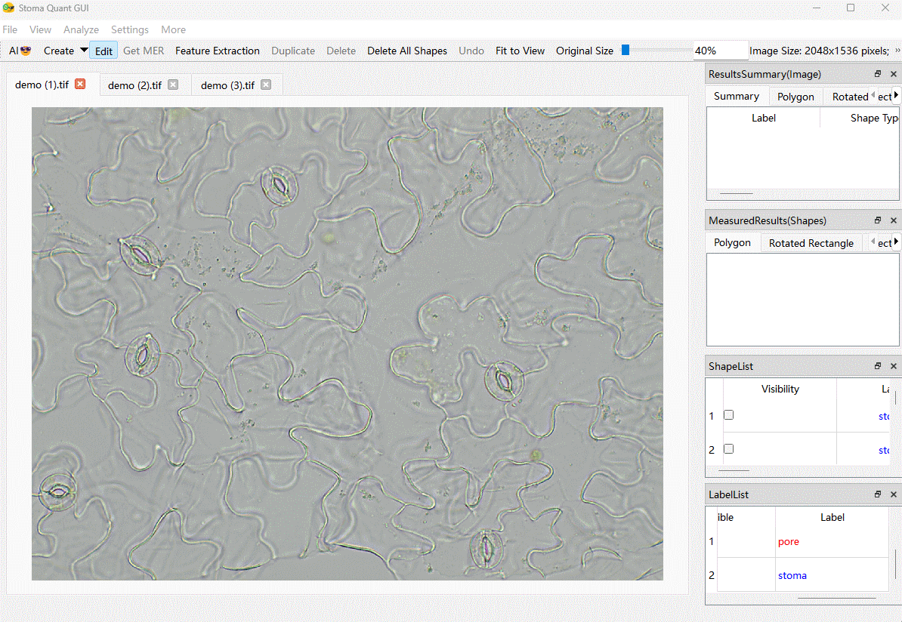
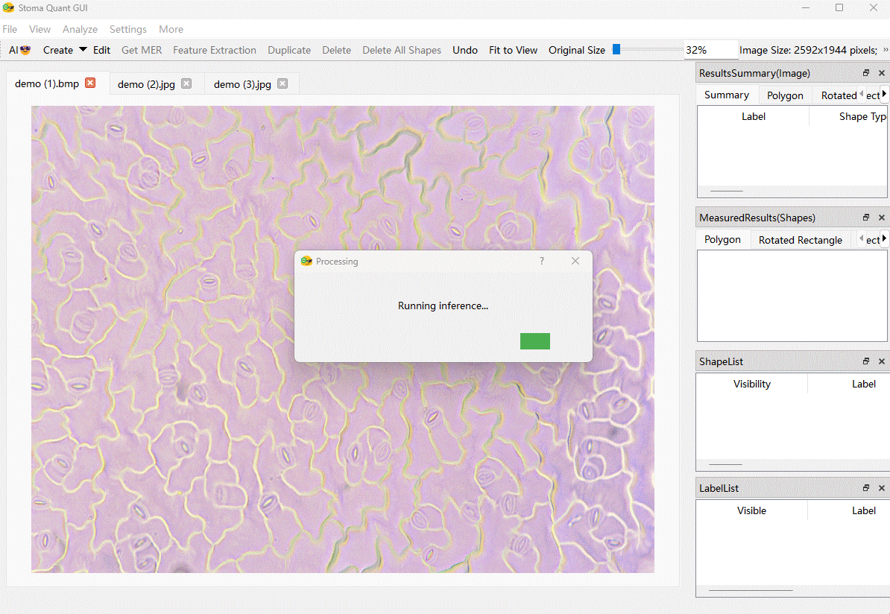
</p>

---

<a id="stomataquant-20-release-notes"></a>

## 🚀 StomataQuant 2.0 Release Notes — 2026/10/02

**StomataQuant 2.0 is a major update.** The biggest change is that the old **Feature Extraction** step has been removed. Measurements are now kept up to date automatically while you work.

- **Automatic measurement:** edit annotations or change the measurement scale, and the results refresh automatically.
- **New Windows packages:** both **CPU** and **NVIDIA GPU** versions are available. The GPU package is intended for compatible NVIDIA graphics cards.
- **New ways to import images:** open folders directly or drag and drop files/folders into StomataQuant.
- **Better annotation workflows:** Point annotation import/export, batch Point annotation handling, complete annotation sessions, unsaved-change reminders, selected-shape export, Redo, and Tab search/navigation.
- **Better batch workflows:** easier image–annotation pairing, clearer failure reports, safer cancellation, and export validation before files are written.
- **General improvements:** multi-image scale management, display settings, ShapeList editing/selection, status-bar information, JPEG orientation handling, and many internal reliability improvements.

**We welcome you to update to StomataQuant 2.0, try it in your own workflow, and send us any feedback or suggestions. Thank you!**


---

<a id="getting-started"></a>

## 🏃‍♀️‍➡️ Getting Started

### Download the application

If you simply want to use StomataQuant, the [**packaged application**](#using-the-packaged-application) is the easiest choice. No Python setup is required.

If you want to modify the code, manage your own Python environment, or develop new functions, use the [**source code**](#using-the-source-code) instead.

<a id="model-weights"></a>

### Model Weights Download

StomataQuant and the AI models are downloaded separately. After installing the program, choose a model according to what you want to measure. See the [**Basic Workflow**](#basic-operation-flow) below.

Available model sizes include **n** (nano), **s** (small), **m** (medium), **l** (large), and **x** (extra large). Larger models are usually slower on CPU, so there is no need to always choose the largest model.

- **All Models** | [Download](https://disk.pku.edu.cn/link/AA86DDC49EB56E4C2DB8E38D10012FE863) | Access code: `RhxL`
    - **Stomata Detection** | [Download](https://disk.pku.edu.cn/link/AA705A6764E6CE4081BBBAFA4F58E2707F) | Access code: `mmxr`
    - **Stomata and Pores Segmentation** | [Download](https://disk.pku.edu.cn/link/AAE53CF06462F749938A669328B07491A2) | Access code: `b2Gu`
    - **Stomata and Pavement Cells Segmentation** | [Download](https://disk.pku.edu.cn/link/AAD83377173700411F9D71804602A08A4A) | Access code: `60m4`

Different species and image types can behave differently. You can also [**use or train other compatible Ultralytics YOLO models**](#train-a-new-model), including models published in previous studies.

- **Multi-species stomatal pore segmentation model from StoManager1:** `multi-species-pore-from_Stomanage1.pt` | [Download](https://disk.pku.edu.cn/link/AA5F99929C817A48899E4530DC23E9A07A) | Access code: `dJDz`  
  This model was trained with stomatal images from multiple plant species and is compatible with StomataQuant. See [Wang et al. (2024)](https://doi.org/10.1093/plphys/kiae049).


<a id="using-the-packaged-application"></a>

### 💻 Using the Packaged Application

#### Application Download

- **Windows**
    - [Windows v2.0 Installer (CPU)](https://disk.pku.edu.cn/link/AA697D6BC2FD88469787F0852789F00688) | Access code: `uN2Z`

    - [Windows v2.0 Installer (NVIDIA GPU)](https://disk.pku.edu.cn/link/AA23D43B94CE864BD08E964A44E21A3B00) | Access code: `A9GK`

    Choose the CPU installer for CPU inference, or the GPU installer for a compatible NVIDIA GPU with a suitable driver. Both are packaged Windows applications.

- **macOS**
    - [macOS v2 Application](https://disk.pku.edu.cn/link/AA79AED4A88FD54E2CA12326B5CA727DC4) | Access code: `PxcA`

    The linked package is a standalone executable. Current source includes macOS-compatible paths; packaged builds should be validated on actual macOS hardware.  

#### Before Running the Packaged Application

##### Windows

- **Step 1: Run the Installer & Choose Path**
    - Open `StomataQuant_v2.0_Windows_CPU_Setup.exe` or `StomataQuant_v2.0_Windows_GPU_Setup.exe`, choose an installation path, and follow **Next → Install**.  

<p align="center">
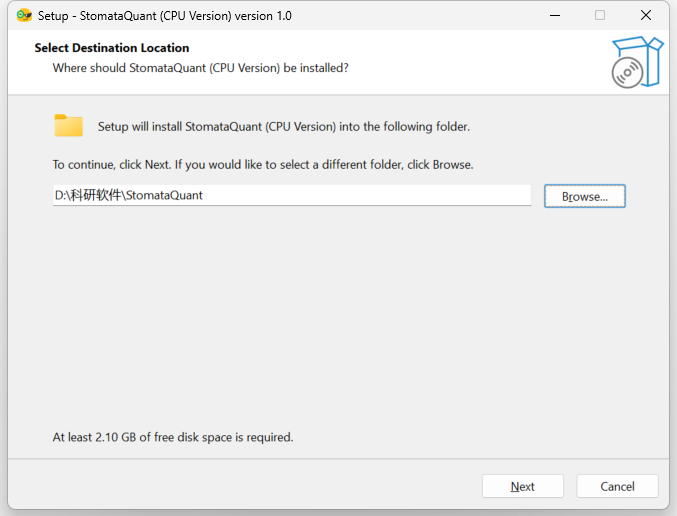


</p>

- **Step 2: Wait for Installation to Complete**
    - Wait while the installer extracts the environment and application files.  

<p align="center">

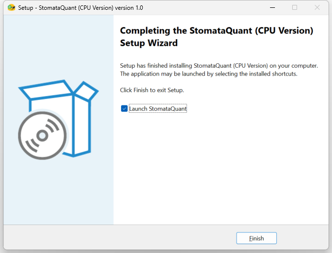
</p>

- **Step 3: Launch and Use**
    - Launch StomataQuant from the Desktop shortcut. If a terminal window opens with the package, keep it open; it can be minimized. Initial startup may take some time.  

<p align="center">
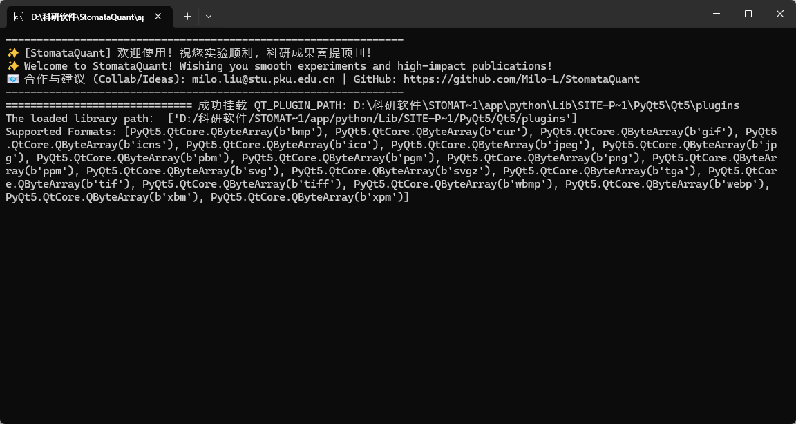
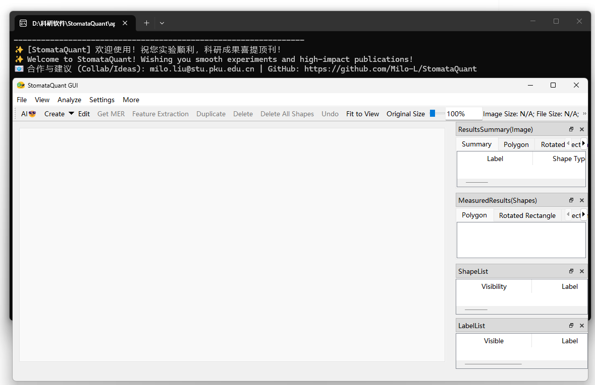
</p>

- **GPU inference:** with the NVIDIA GPU package, choose **Settings → Inference Setting → Inference device → GPU** before running AI. GPU is selectable only when a compatible GPU/CUDA environment is detected; otherwise use **CPU**.

##### macOS

1. Open Terminal and change to the folder containing `StomataQuant_Mac_v2`. Grant execute permission:  

   ```bash
   chmod +x StomataQuant_Mac_v2
   ```

2. If prompted, allow the downloaded executable in macOS security settings.  

<p align="center">
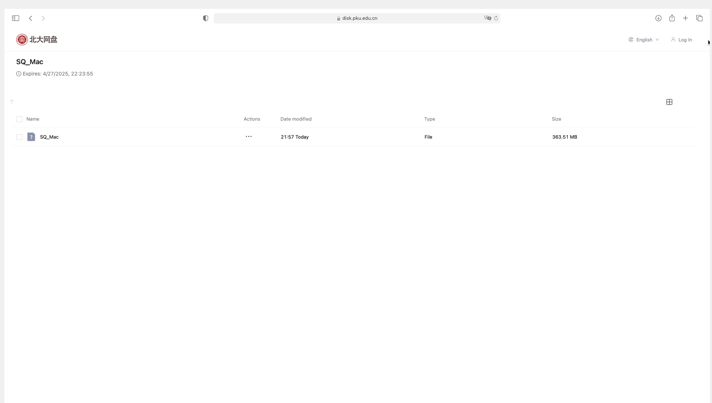
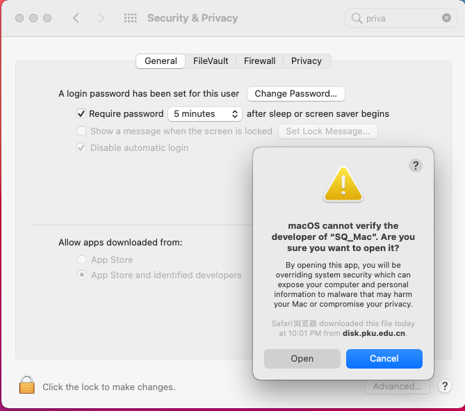
</p>

3. Double-click `StomataQuant_Mac_v2` to launch, or run it from its folder in Terminal:

   ```bash
   ./StomataQuant_Mac_v2
   ```

   Keep any associated Terminal window open. First startup may take longer while the environment loads.  

<p align="center">
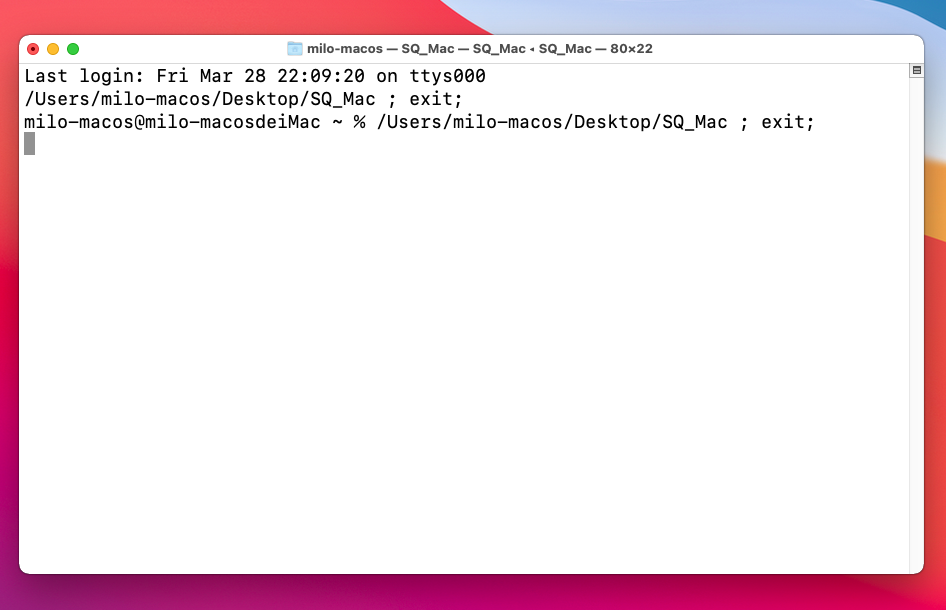
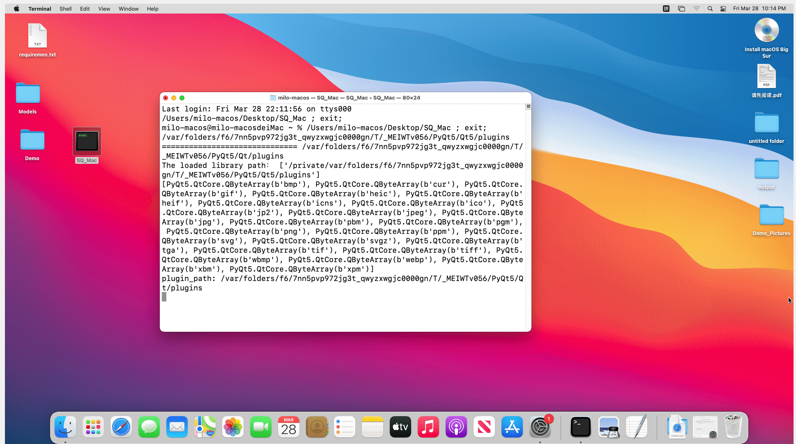
</p>

<a id="using-the-source-code"></a>

### 🧑‍💻 Using the Source Code

If you prefer to run StomataQuant from Python or want to modify the code, clone the repository and install the required packages.  

1. **Clone the repository**
   ```bash
   git clone https://github.com/Milo-L/StomataQuant.git
   ```

2. **Install dependencies**
   ```bash
   pip install -r SQ_gpu_requirements.txt
   ```

   or

   ```bash
   pip install -r SQ_cpu_requirements.txt
   ```

   Choose the requirement file that matches your environment. GPU users should make sure their NVIDIA driver and CUDA environment are compatible. On macOS, some Python packages may need platform-specific versions.  

3. **Start StomataQuant**
   ```bash
   python Load_StomataQuant_GUI.py
   ```

   After the program opens, download a suitable [**model weight**](#model-weights) and load it through **Settings → Model Setting** before running AI inference.

---
<a id="program-usage-guide"></a>

## 📄 Program Usage Guide

The images and GIFs below illustrate the workflows; follow the accompanying instructions for the current controls.  

<a id="key-features"></a>

### 😎 Key Features

1. **AI detection and segmentation**
    - Load a compatible YOLO model and let StomataQuant detect or segment stomata, pores, or pavement cells.

2. **AI results are editable**
    - AI results are converted into normal editable shapes on the Canvas. You can move, add, delete, relabel, hide, or correct them before using the results.

3. **Automatic measurements**
    - There is no separate measurement step in StomataQuant 2.0. Measurements update automatically when annotations or scales change.

4. **Five annotation shapes**
    - Polygon, Rectangle, Rotated Rectangle / OBB, Line, and Point are supported for different annotation and measurement tasks.

5. **Batch workflows**
    - Multiple open images can be processed together for inference, filtering, annotation import/export, MER generation, Point conversion, heatmaps, and result export.

6. **Sessions and recovery**
    - Complete annotation sessions can be saved and restored, including different shape types, labels, class IDs, group IDs, and visibility.


<p align="center">
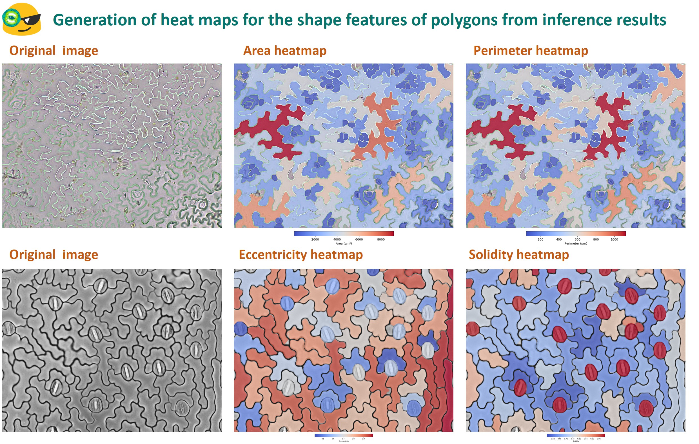
</p>

<a id="basic-operation-flow"></a>

### 📣 Basic Workflow — How StomataQuant Works

A typical StomataQuant workflow looks like this:

> **Open image → Choose model → Run AI → Check/edit annotations → Set scale if needed → Measurements update automatically → Save annotations or export results**

Detection boxes and segmentation contours appear on the Canvas as editable annotations. You can check and correct them directly, and StomataQuant calculates measurements from the annotations currently shown.

#### 01. Open Images

- Use **File → Open Images** to open one or more images.
- You can also use **Open Folder...**, or drag and drop images/folders into StomataQuant.
- Each image opens in its own Tab and keeps its own annotations, Undo/Redo history, measurement results, and scale settings.
- When you close a Tab with unsaved annotations, StomataQuant will ask whether you want to **Save**, **Discard**, or **Cancel**.

<p align="center">
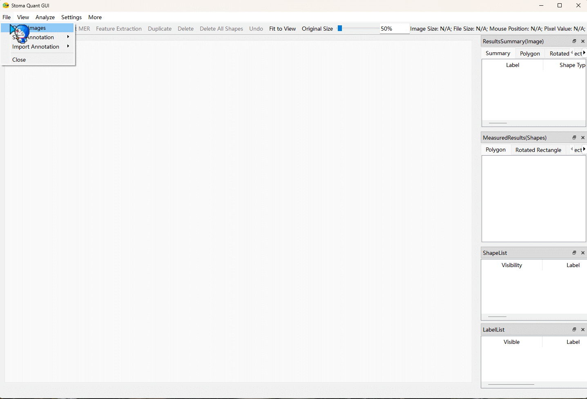
</p>

#### 02. Choose a Model

Go to **Settings → Model Setting** and load a compatible `.pt` or `.onnx` model.

Choose the model according to your task:

- **Stomata detection model** → returns Rectangle boxes; useful for stomatal counts, distribution, and density.
- **Stomata + pore segmentation model** → returns Polygon contours; useful for stomatal and pore size/shape measurements.
- **Stomata + pavement-cell segmentation model** → returns Polygon contours; useful for pavement-cell analysis and stomatal-index workflows.

You can switch models at any time, including compatible models trained by yourself or published in previous studies.

#### 03. Run AI

Before inference, you can adjust **Settings → Inference Setting**, including confidence, IoU, CPU/GPU device, image size, and maximum detections.

Click **AI** to run the current model on the active image.

- Detection results become **Rectangle** shapes.
- Segmentation results become **Polygon** shapes.
- New AI results are added to the annotations already on the Canvas, so you can compare or edit them together.
- StomataQuant checks segmentation contours before adding them to the Canvas and shows a warning if a contour cannot be used.

<p align="center">
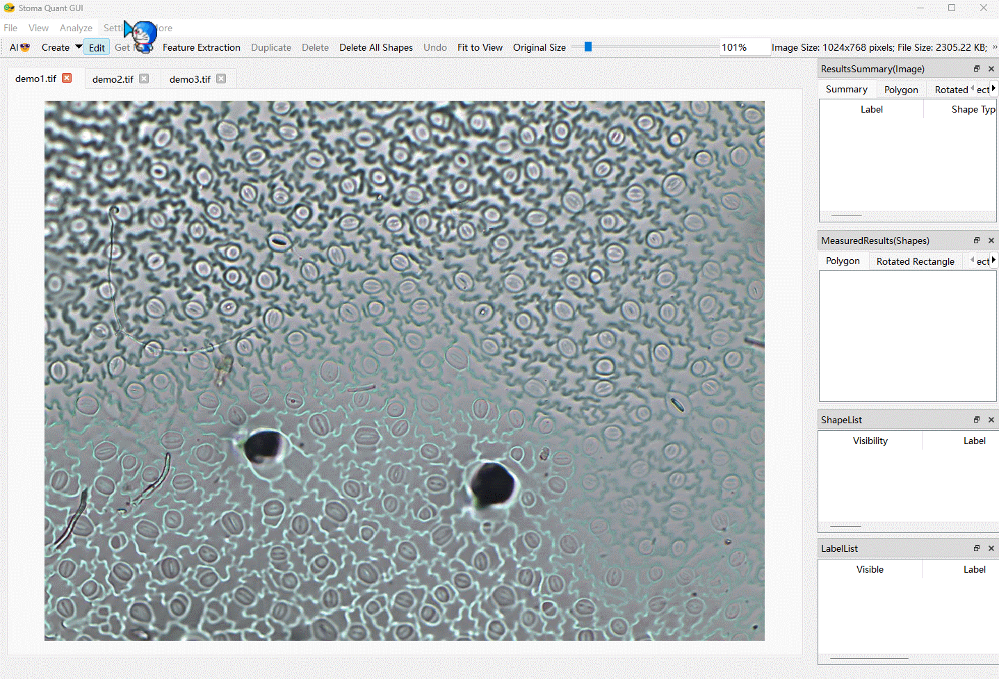
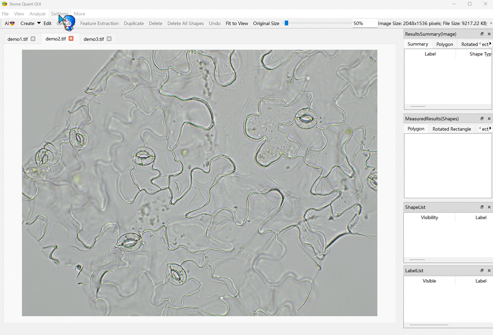
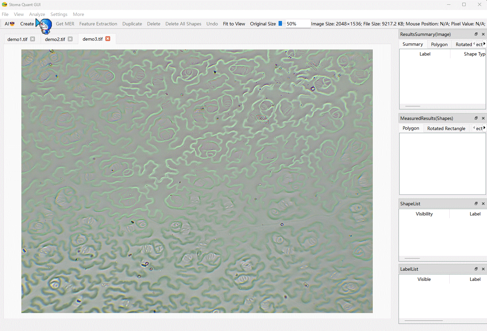
</p>

#### 04. Check and Correct the AI Results

After AI inference, take a quick look at the annotations and correct anything that needs adjustment. See [**Shape Editing**](#shape-editing) for the available editing tools.

AI predictions become regular Canvas shapes, so you can edit them just like annotations you created yourself:

- move or resize shapes;
- edit Polygon vertices;
- add missing shapes;
- delete incorrect shapes;
- change labels or class IDs;
- hide shapes you want to leave out of the current analysis;
- use **Undo / Redo** if you make a mistake.

**ShapeList** shows each annotation, while **LabelList** helps you show or hide groups of labels. Selection is linked between the Canvas, ShapeList, and measurement tables.

#### 05. Measurement and Results

<a id="measurement-and-results"></a>

Measurements update automatically from the annotations currently shown on the Canvas.

For pixel-based measurements, the results are ready immediately.

For physical units, set a measurement scale:

1. Choose **Analyze → Set Measuring Scale**.
2. Enter a known **Pixel distance**, its corresponding **Real-world distance**, and the unit.
3. Apply the scale to the selected image or to all open images.
4. The measurement tables update automatically.

**MeasuredResults** shows measurements for individual shapes. **ResultsSummary** shows image-level counts and statistics.

Depending on the shape type, StomataQuant reports measurements such as area, perimeter, length, width, aspect ratio, angle, circularity, eccentricity, convexity, solidity, and center coordinates.

Hidden shapes are excluded from the current measurements.

<p align="center">
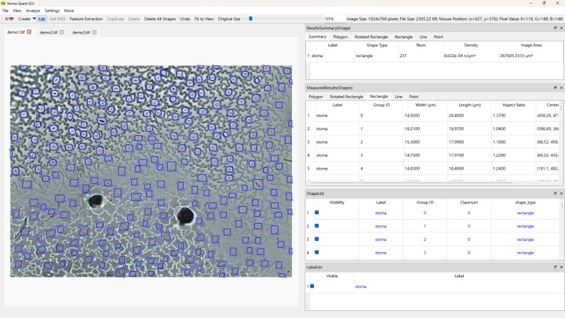
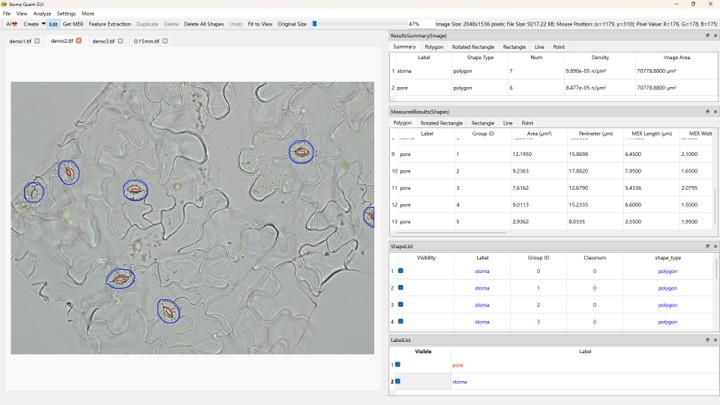
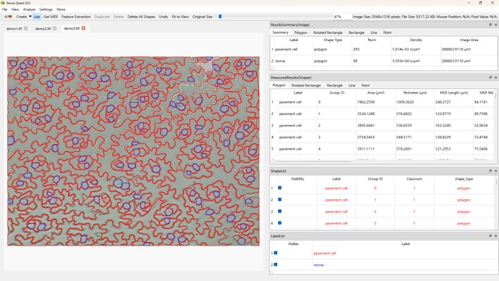
</p>

#### 06. Save Annotations or Export Results

After checking the annotations, you can save them for later use or export measurement results.

- **File → Save Annotation** saves annotations for the active image.
- **More → Batch Export** exports annotations from multiple open images.
- Right-click a result table to **Copy** or **Export CSV**.
- **More → Export Feature csv** exports measurement results from multiple Tabs.

A simple way to work is:

**AI first → correct the annotations → set the scale if needed → export the final results.**

<p align="center">
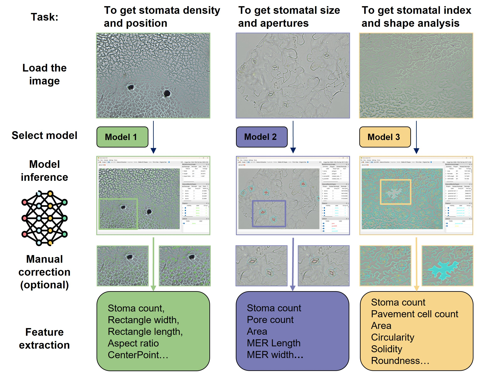
</p>


<a id="common_usage_scenarios"></a>

### 🕵️ Common Usage Scenarios

#### Measure stomatal aperture or size

1. After segmentation, use **MER** to generate minimum enclosing rotated rectangles from visible polygons. The source polygons remain on the Canvas.  
2. Hide the original polygons in ShapeList or LabelList to review the generated OBB shapes, then resize or rotate them as needed.  
3. Set the measurement scale and read the updated length/width in MeasuredResults. Interpret these geometric measurements according to the annotated stoma or pore.  

<p align="center">

</p>

#### Calculate stomatal index

1. Use **Analyze → Shape Filter** to remove shapes near all edges, the top/left edges, or the right/bottom edges, as appropriate for your counting rule.  
2. Use **View → All shapes are displayed as points** to convert visible Polygon, Rectangle, or OBB shapes into Points. This changes the annotations and can be undone.  
3. Review cell counts by adding, moving, relabeling, or deleting Points. Read counts by label in ResultsSummary and calculate the stomatal index from the stomatal and pavement-cell counts.  

<p align="center">

</p>

#### Generate a heatmap

- Set the scale if physical units are needed, and allow polygon measurements to update.  
- Choose **View → Heat Map of polygon features**, then select a feature, color scheme, and output folder.  
- The output is a PNG overlay of visible polygons with a color bar.  

<p align="center">

</p>

<a id="batch-processing"></a>

#### Process multiple images

- Open at least two image Tabs, then choose **More → Batch Processing**. Load the required model before selecting AI inference.  
- Choose AI inference, edge filtering, class visibility, group ID display, conversion to Points, MER generation, or polygon heat maps. MER can optionally hide its original polygons. Measurements update for affected images.  
- The batch dialog also provides model switching and inference settings before processing. **Cancel** requests a safe stop; completed work is retained and pending operations are canceled.  
- Use **More → Batch Import**, **Batch Export**, and **Export Feature csv** for annotation pairing and result export; details are provided below.  

<p align="center">
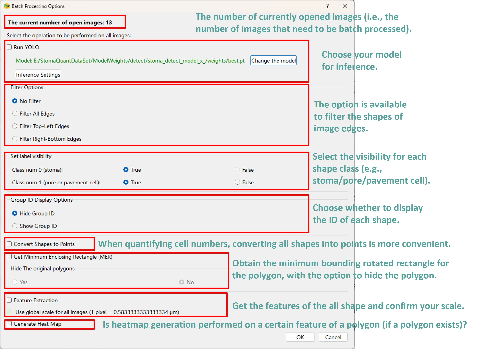

</p>

#### Shape Creation

- Create **Polygon, Rotated Rectangle / OBB, Rectangle, Line, or Point** from the **Create** menu.  
- **Create Polygon:** left-click to add vertices; finish by double-clicking or clicking the first point. Use at least five distinct vertices and valid, non-self-intersecting geometry.  
- **Create Rotated Rectangle / OBB:** define the first side, then click to set the perpendicular extent and complete the rectangle.  

<p align="center">
    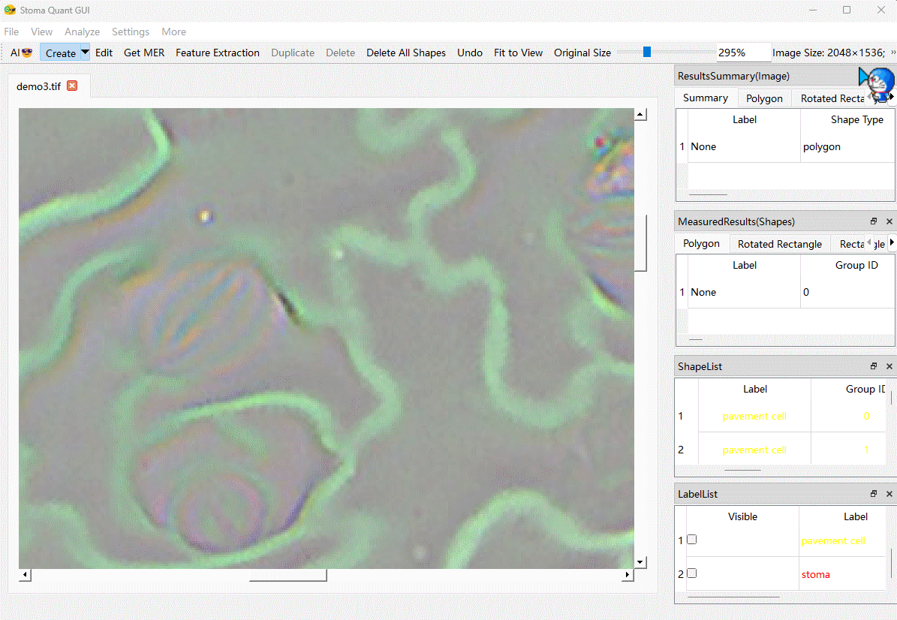
    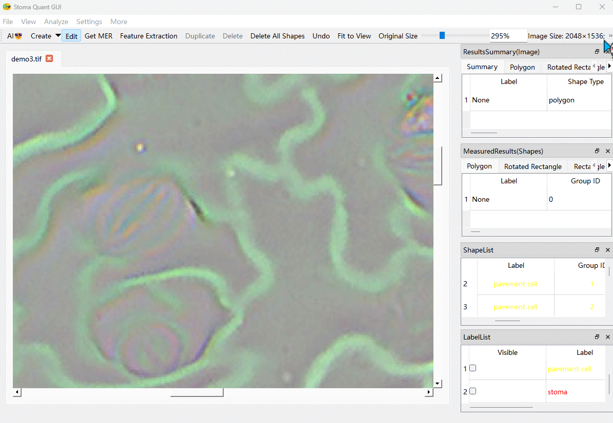
    </p>

- **Create Rectangle:** drag between opposite corners to create an axis-aligned box.  
- **Create Line:** drag from the start point to the end point.  
- **Create Point:** click to place a point.  

<p align="center">
    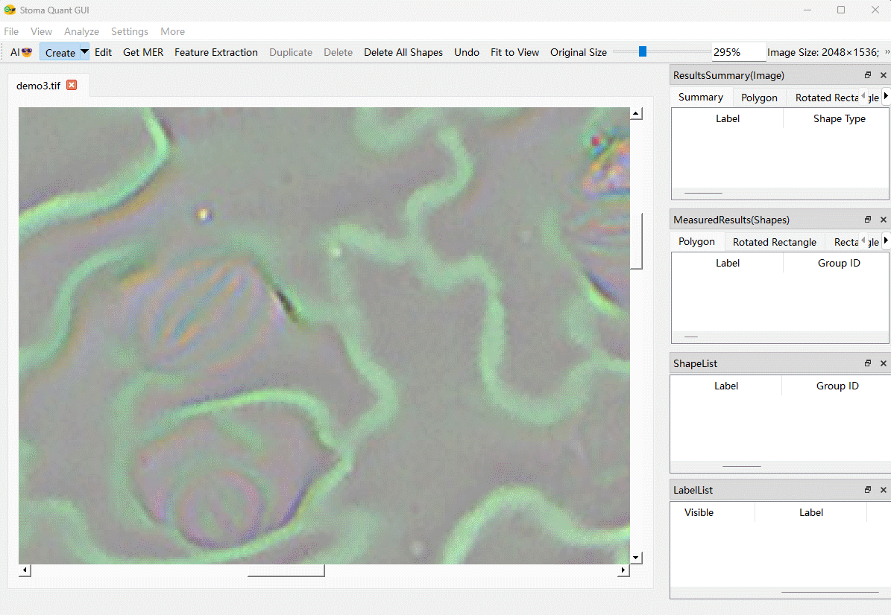
    
    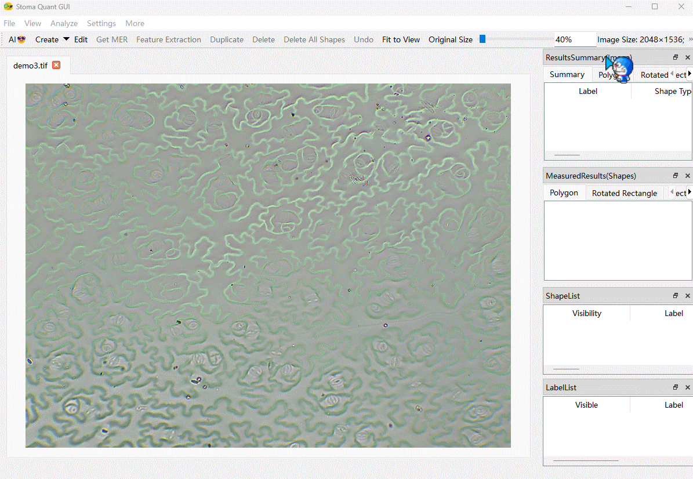
    </p>

<a id="shape-editing"></a>

#### Shape Editing

- Select **Edit Shapes** to move or adjust Polygon, Rectangle, OBB, Line, and Point shapes. Use **Alt-click** to cycle through overlapping shapes.  
- Delete selected shapes with **Delete**. Duplicate with **Ctrl+D**, the **Duplicate** button, or **Ctrl+C** while Canvas/ShapeList has focus. In result tables, **Ctrl+C** copies table values.  
- **Undo / Redo** (**Ctrl+Z / Ctrl+Y**) restores or reapplies annotation edits in the active Tab. **Clear All** removes visible shapes after confirmation.  
- Toggle visibility in **ShapeList** for individual shapes or **LabelList** for a label group. Hidden shapes remain in the session but are excluded from measurements and normal type-specific TXT export. Labels and class numbers can be edited in ShapeList.  
- **Edit Polygon:** drag a vertex to move it; click an edge to insert a vertex. Right-click a vertex to remove it, or use Ctrl+right-click for multiple vertices. Edits must keep at least five vertices and valid geometry.  
- **Edit Rotated Rectangle / OBB:** drag a corner to resize; drag the rotation handle to rotate.  

<p align="center">
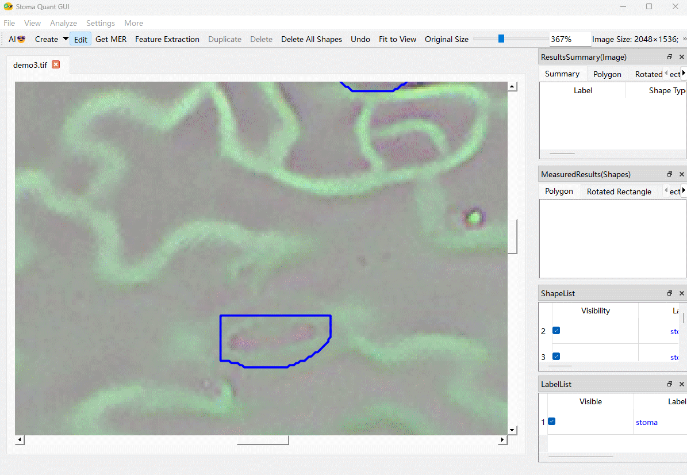
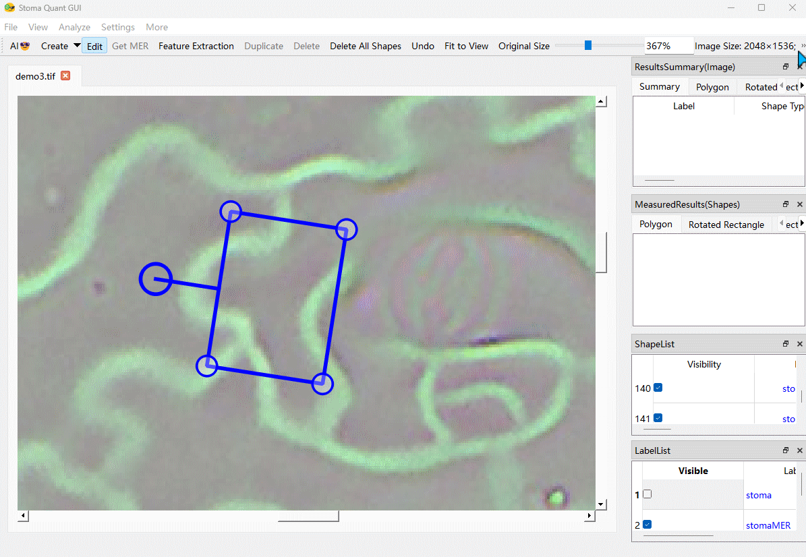
</p>

- **Edit Rectangle:** drag a corner to resize the box.  
- **Edit Line:** drag endpoints to adjust the line, or move it using its center.  
- **Edit Point:** drag to move; edit its label or class number in ShapeList when needed.  

<p align="center">
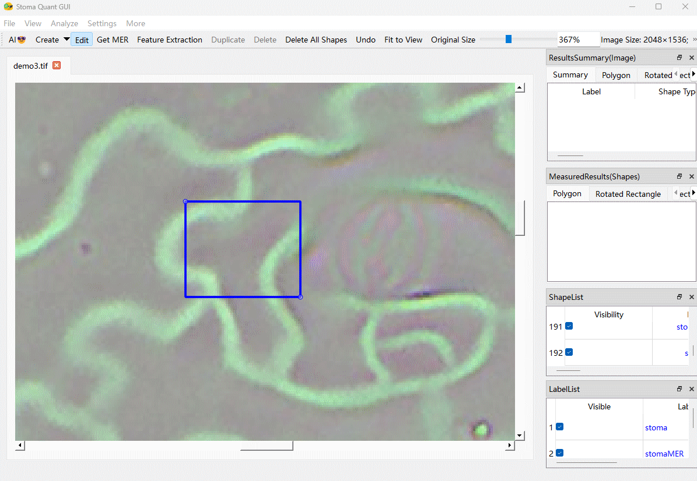
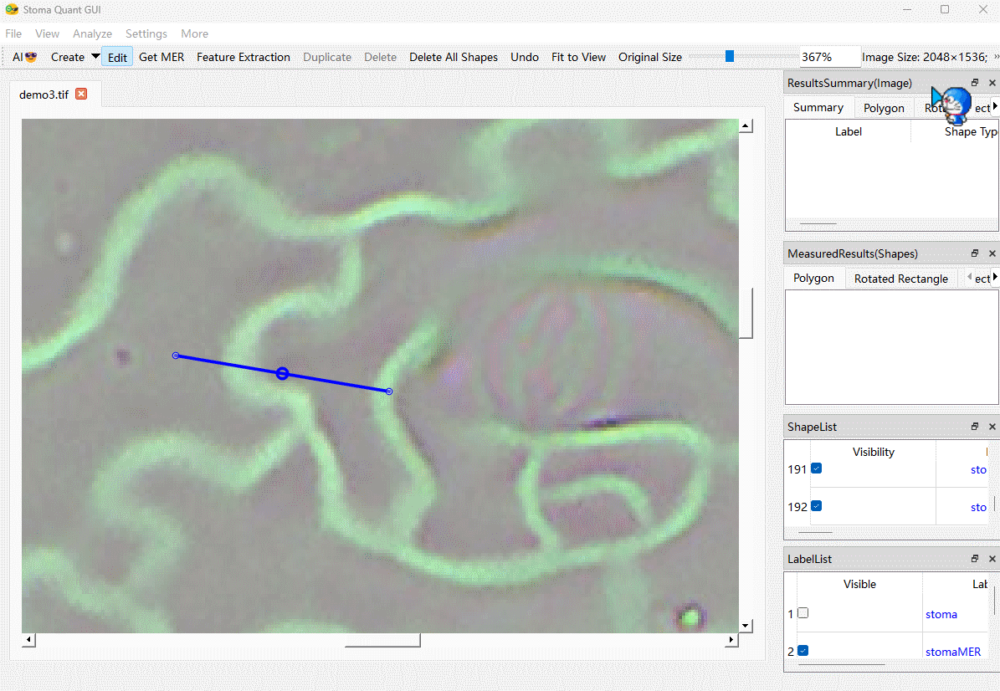
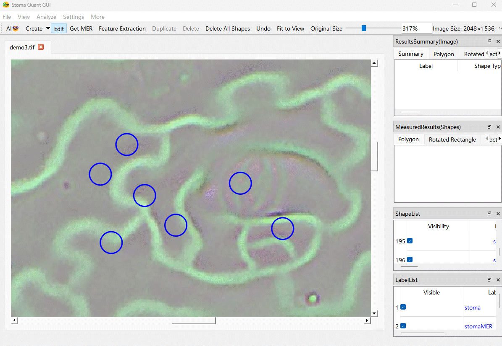
</p>

<a id="annotation-import-and-export"></a>

#### Shape Annotation Import and Export

- Import or save annotations for the active image through **File → Import Annotation / Save Annotation**. Use **More → Batch Import / Batch Export** for multiple images. ShapeList's **Export Annotation** context action exports a same-type selection.  

- **Annotation formats**
    - **Rectangle:** normalized YOLO TXT: `class_id center_x center_y width height`. A second import format accepts a pixel-coordinate table with this complete header, separated by commas or whitespace:  
      ```text
      x1 y1 x2 y2 center_x center_y confidence class_id class_name
      ```
      Rectangle export uses normalized YOLO TXT.  
    - **Polygon:** normalized YOLO segmentation TXT: `class_id x1 y1 x2 y2 ...`; at least five coordinate pairs and valid polygon geometry are required for TXT import.  
    - **Rotated Rectangle / OBB:** normalized TXT: `class_id x1 y1 x2 y2 x3 y3 x4 y4`; four corners must form a non-degenerate rectangle in perimeter order.  
    - **Point:** StomataQuant TXT: `class_id x y`, with normalized coordinates in [0, 1]. This is a point annotation format, not YOLO pose format.  
    - **Line:** supported for drawing, editing, measurement, and session JSON; there is no Line TXT import/export menu.  

- **Annotation checks**
    - Rectangle, Polygon, and OBB files are checked before they are added. If StomataQuant finds a problem, it shows the file, line number, and reason so you can fix the annotation first.
    - Shapes that lie completely outside the image are not imported. Partly out-of-bounds shapes can still be kept, with their original coordinates unchanged.
    - Export is checked before a file is written, helping protect existing output files when an annotation contains a problem.
    - Point annotation files are checked before Points are added.


- **Batch Import and matching**
    - Use currently open images, or select an image directory when no image is open, then select the TXT annotation directory. Exact matches use image stems and recognized StomataQuant export names. Conservative fuzzy matches can propose remaining pairs; ambiguous pairs need manual review.  
    - Confirm or change the image–annotation pairs, reorder them, or uncheck items to skip. Each enabled image needs one unique annotation file. For an existing Canvas, choose **Append**, **Replace all existing shapes**, or **Cancel**. Review the import report afterward.  
    - **Cancel** retains completed imports and prevents the current unfinished import from being added. Batch Export writes visible shapes of the selected TXT type from open Tabs.  

- **Annotation session and recovery**
    - A StomataQuant session JSON saves all five shape types, labels, class numbers, group IDs, and visibility. Saving through the single-image annotation menu also writes a companion session; when closing an edited Tab, **Save** can save the complete session.  
    - Reopening an image restores a saved session when found and its image dimensions match. Scales, derived measurements, and view state are not stored in this JSON; recheck calibration after reopening.  

Annotations can also be used to [train or fine-tune models](#train-a-new-model).  

<a id="train-a-new-model"></a>

#### Use or Train Other Models

StomataQuant can load compatible Ultralytics YOLO detection and segmentation models, so you can also use models from previous studies or train/fine-tune your own model for a new species or imaging condition.

For model training, see the official [Ultralytics training documentation](https://docs.ultralytics.com/modes/train/).  

---
<a id="dataset-used-for-training-the-model"></a>

## 📖 Dataset used for training the model

The StomataQuant training and validation dataset repository is linked on **Zenodo**: [https://zenodo.org/records/18934358](https://zenodo.org/records/18934358).  

<p align="center">
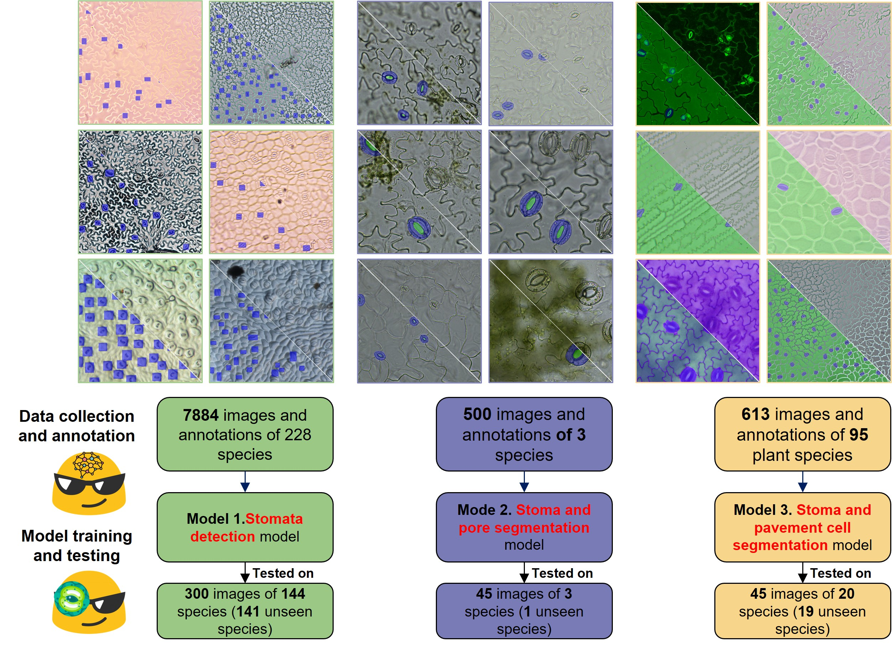
</p>

<a id="technical-architecture"></a>

## 🧩 Software Architecture

- **UI framework:** [PyQt5](https://www.riverbankcomputing.com/static/Docs/PyQt5/)
- **Model training and inference:** [Ultralytics YOLO](https://github.com/ultralytics/ultralytics) (the official StomataQuant models are based on YOLO11)
- **Shape and data analysis:**
    - [OpenCV](https://github.com/opencv/opencv)
    - [PIL (Pillow)](https://github.com/python-pillow/Pillow)
    - [NumPy](https://github.com/numpy/numpy)
    - [Shapely](https://github.com/shapely/shapely)
- **Acceleration:** [Numba](https://github.com/numba/numba)
- **Heatmap visualization:** [Matplotlib](https://github.com/matplotlib/matplotlib)

<a id="code-file-structure"></a>

### 🗃️ Code file structure

If you want to explore or modify the code, the main modules are listed below.  

1. **Main Application Files**
    - `Load_StomataQuant_GUI.py`: application entry, main-window actions, image Tabs, and workflow coordination.  
    - `StomataQuant_GUI.py`: menus, toolbars, and base UI layout.  

2. **Graphics and Drawing Components**
    - `shape.py` and `canvas.py`: the five Shape types, geometry, drawing, and editing.  
    - `ImageGraphicsView.py`: image display and zoom; `shape_history.py`: Undo/Redo; `tab_navigation.py`: Tab navigation.  

3. **Inference and Processing Components**
    - `InferenceThread.py` and `inference_worker.py`: detection/segmentation inference, polygon processing, AB/AD classification, and heat-map generation.  
    - `inference_support.py`: converts predictions to Canvas shapes.  

4. **Interface Components**
    - `dock_widgets.py`: ShapeList, LabelList, MeasuredResults, and ResultsSummary.  
    - `measurements.py`, `measurement_controller.py`, `measurement_rows.py`, and `measurement_summary.py`: measurement updates and result tables/statistics.  
    - `toolbar_ui.py` and `keyboard_shortcuts.py`: toolbar controls and shortcuts.  

5. **Batch Processing Functionality**
    - `BatchProcessor.py` and `batch_ui.py`: batch operations and import/export workflows.  
    - `annotation_io.py`, `annotation_matching.py`, `point_annotations.py`, and `annotation_session.py`: annotation formats, matching, Points, and sessions.  
    - `drop_workflow.py`: folder and file-drop workflows.  

6. **Dialog Components**
    - `AllDialogs.py`: batch, inference, label, display, and heat-map settings.  
    - `scale_dialog.py`: measurement scale settings; `dialog_ui.py`: shared dialog layout.  

7. **Resources**
    - `resources_rc.py`: embedded Qt resources; `macos_paths.py`: macOS bundle resource lookup and writable output paths.  

<a id="citation"></a>

## 📑 Citation

If you use **StomataQuant** in your research, please cite the following paper:  

> Liu, M.-L., Ren, Z.-R., Wei, J., Zhang, H., Li, Y.-K., Wang, G.-Y., Xie, P., & Wang, Y. (2026).  
> **Integrating automated detection and segmentation for quantitative analysis of stomata and pavement cells using StomataQuant.** *Journal of Plant Ecology*, rtag063.  
> [https://doi.org/10.1093/jpe/rtag063](https://doi.org/10.1093/jpe/rtag063)

### BibTeX

```bibtex
@article{StomataQuant2026,
  title = {Integrating Automated Detection and Segmentation for Quantitative Analysis of Stomata and Pavement Cells using StomataQuant},
  author = {Liu, Meng-Long and Ren, Zi-Rong and Wei, Jian and Zhang, He and Li, Yu-Kang and Wang, Gu-Yan and Xie, Peng and Wang, Yin},
  journal = {Journal of Plant Ecology},
  year = {2026},
  pages = {rtag063},
  doi = {10.1093/jpe/rtag063},
  url = {https://doi.org/10.1093/jpe/rtag063}
}
```

<a id="license"></a>

## 📜 License

- This project is licensed under **AGPL-3.0**; see [LICENSE](LICENSE) for the full terms. Preserve the applicable copyright notices and comply with the license's source-code requirements. For commercial licensing inquiries, contact the authors.  

<a id="contact-us"></a>

## 🤝 Contact Us

- 🌱 **Feedback and contributions are welcome!**
- If you have tried StomataQuant on your own images, we would be happy to hear how it worked and what could be improved. You can reach us through [**Contact Us**](#contact-us).
- We especially welcome compatible models for additional species, multi-species datasets, different imaging conditions, and useful annotation or analysis features.  

- For questions, bug reports, or collaboration inquiries, open an issue or submit a pull request on [GitHub](https://github.com/Milo-L/StomataQuant), or contact:  

    - **Menglong Liu**  
      GitHub: [https://github.com/Milo-L/](https://github.com/Milo-L/)  
      Email: milo.liu@stu.pku.edu.cn

    - **Dr. Yin Wang**  
      Profile: [http://scholar.pku.edu.cn/wangyin](http://scholar.pku.edu.cn/wangyin)  
      Email: wangyinpku@pku.edu.cn

---

<p align="center">
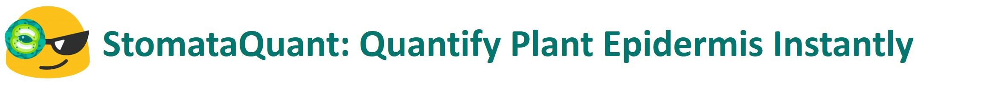
</p>
